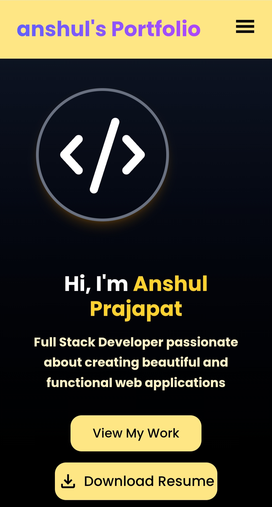
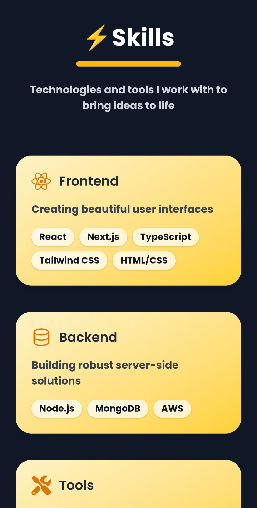
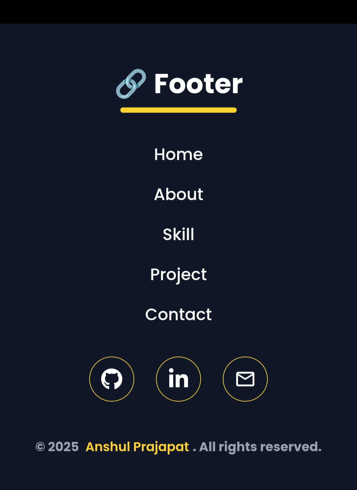
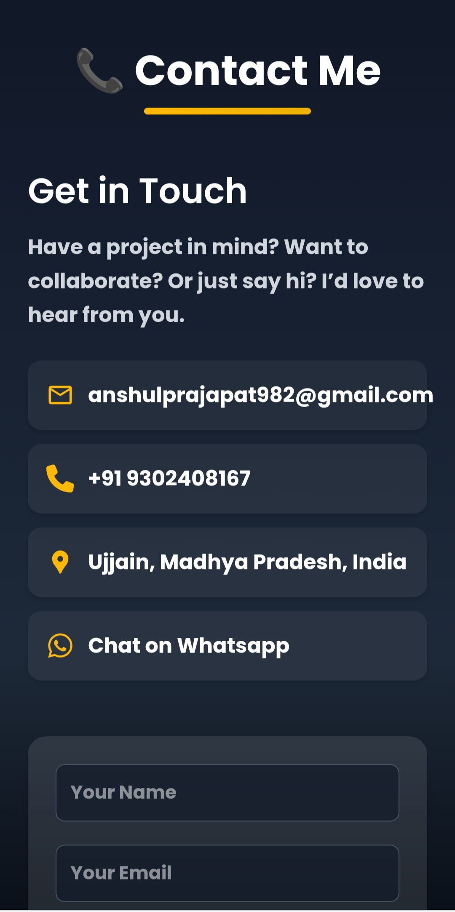

  

# 🌟 My React Portfolio  

<div align="center" style="display: flex; justify-content: center; gap: 20px; flex-wrap: wrap;">

  <picture>
    <source media="(max-width: 600px)" srcset="./src/assets/img1.jpg" />
    
  </picture>

  <picture>
    <source media="(max-width: 600px)" srcset="./src/assets/img2.jpg" />
    
  </picture>

  <picture>
    <source media="(max-width: 600px)" srcset="./src/assets/img3.jpg" />
    
  </picture>

  <picture>
    <source media="(max-width: 600px)" srcset="./src/assets/img4.jpg" />
    
  </picture>

</div>  


---

🚀 A modern and fully responsive **React Portfolio Website** to showcase my **skills, projects, resume, and contact information**.  
It’s designed with clean UI, smooth animations, and a professional touch.  

🔗 **Live Demo**: [View Portfolio](https://anshulportfolioooo.netlify.app)  
📂 **GitHub Repo**: [Portfolio Repository](https://github.com/Anshul09052004/My-Portfolio)  

---

## ✨ Features  

- 🎨 **Beautiful Modern UI** (TailwindCSS + custom CSS)  
- 📱 **Fully Responsive Design** (Desktop / Tablet / Mobile)  
- ⚡ **Framer Motion Animations** for smooth interactions  
- 🧑‍💻 **Projects Showcase** with live demo & GitHub links  
- 📜 **Resume Download Section**  
- 📩 **Contact Form with EmailJS** integration  

---

## 🛠️ Tech Stack  

- ⚛️ **React.js** (Frontend Library)  
- 🎨 **Tailwind CSS** (Styling)  
- 🎞️ **Framer Motion** (Animations)  
- 📧 **EmailJS** (Contact Form Handling)  
- 🔗 **React Router** (Navigation)  

---

## 📂 Folder Structure  

```bash
portfolio/
├── public/
│   ├── favicon.ico
│   └── profile.png
├── src/
│   ├── assets/        
│   ├── components/    
│   ├── pages/      
│   ├── App.jsx
│   ├── index.css
│   └── main.jsx
└── package.json


# Clone the repository
git clone git@github.com:Anshul09052004/My-Portfolio.git

# Navigate into the project folder
cd portfolio

# Install dependencies
npm install

# Start the development server
npm run dev
